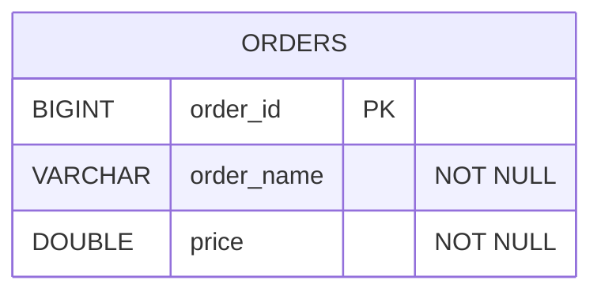
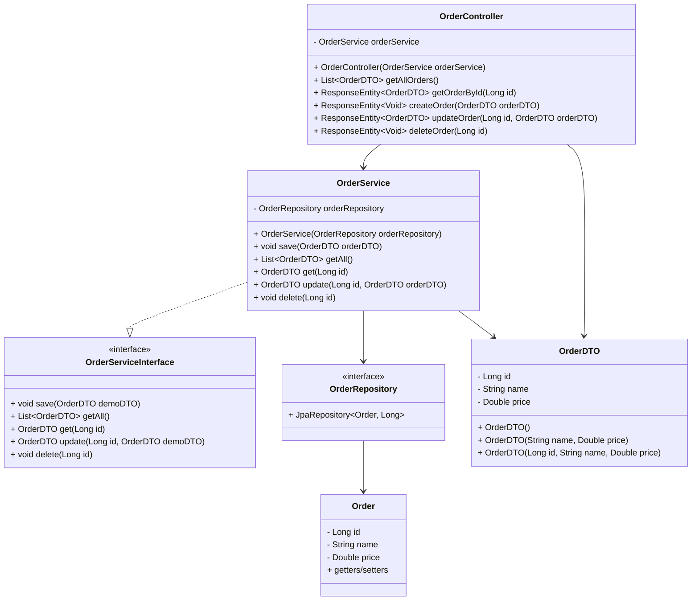

# Order Management App

This project contains a Spring Boot backend and a React frontend for managing orders.

## Project structure

- backend: Spring Boot REST API with H2 database and Spring Security
- frontend: React + Vite app for the order UI

## Prerequisites

- Java 17+
- Maven 3.9+
- Node.js 20.19+ or 22.12+
- npm

## Backend

### Run locally

From the project root:

```bash
./mvnw spring-boot:run
```

On Windows PowerShell, if script execution is blocked:

```powershell
powershell -ExecutionPolicy Bypass -File .\mvnw.cmd spring-boot:run
```

### Test backend

```bash
./mvnw test
```

Or on Windows:

```powershell
powershell -ExecutionPolicy Bypass -File .\mvnw.cmd test
```

### Default backend URLs

- API base: http://localhost:8080/api/orders
- Swagger UI: http://localhost:8080/swagger-ui/index.html
- H2 console: http://localhost:8080/h2-console

### Default credentials

- username: admin
- password: admin123

## Frontend

### Install dependencies

From the frontend folder:

```bash
cd frontend
npm install
```

### Run in development mode

```bash
cd frontend
npm run dev -- --host 0.0.0.0
```

### Build for production

```bash
cd frontend
npm run build
```

### Preview production build

```bash
cd frontend
npm run preview -- --host 0.0.0.0
```

### Frontend URL

- Vite dev server: http://localhost:5173
- If port 5173 is in use, Vite will select another available port automatically.

## Cross-machine / different environment notes

### On another machine in the same network

- Start the backend on the target machine.
- The frontend uses the backend URL in the code:
  - http://localhost:8080/api/orders
- If the frontend runs on another machine or container, replace localhost with the backend machine IP or hostname, for example:
  - http://192.168.1.25:8080/api/orders

### If running backend and frontend on different machines

Update the API URL in:

- frontend/src/App.jsx

Example:

```js
const API_URL = 'http://192.168.1.25:8080/api/orders'
```

### If you use a different port

Update the backend `server.port` in:

- src/main/resources/application.properties

Example:

```properties
server.port=9090
```

Then change the frontend URL accordingly.

## Common issues

### Windows PowerShell blocks scripts

Use:

```powershell
powershell -ExecutionPolicy Bypass -File .\mvnw.cmd ...
```

### Vite engine warnings

Use Node.js 20.19+ or 22.12+ when running the frontend.

### CORS issues

The backend CORS configuration allows requests from local frontend origins such as:

- http://localhost:5173
- http://127.0.0.1:5173

If the frontend runs on another host or port, update the CORS allowed origins in:

- src/main/java/com/example/demo/config/SecurityConfig.java

## Notes

- The backend uses an in-memory H2 database.
- Data is reset when the backend restarts.
- Swagger is enabled and secured by the same Spring Security rules.

## ERD

## Class Diagram


## Sequence Diagram
```mermaid
equenceDiagram
    actor User
    participant Frontend
    participant OrderController
    participant OrderService
    participant OrderRepository
    participant Database

    User->>Frontend: Open order page / submit request
    Frontend->>OrderController: HTTP request to /api/orders
    OrderController->>OrderService: getAll() / get(id) / save(orderDTO) / update(id, orderDTO) / delete(id)
    OrderService->>OrderRepository: findAll() / findById(id) / save(order) / save(entity) / deleteById(id)
    OrderRepository->>Database: SQL query / insert / update / delete
    Database-->>OrderRepository: Entity data / confirmation
    OrderRepository-->>OrderService: Order entity / list
    OrderService-->>OrderController: OrderDTO / status
    OrderController-->>Frontend: JSON response / HTTP status

```

## Spring Security Details
This app uses Spring Security with HTTP Basic authentication and an in-memory user store.

Main configuration
The security setup is in SecurityConfig.java.

It does these things:

- enables web security
- disables CSRF for the REST API
- enables CORS
- allows public access to Swagger and H2 endpoints
- requires authentication for everything else
- uses HTTP Basic auth
- creates a default in-memory user
- Default user
- From the same config:

- username: admin
- password: admin123
- This user is created with an in-memory UserDetailsManager.

